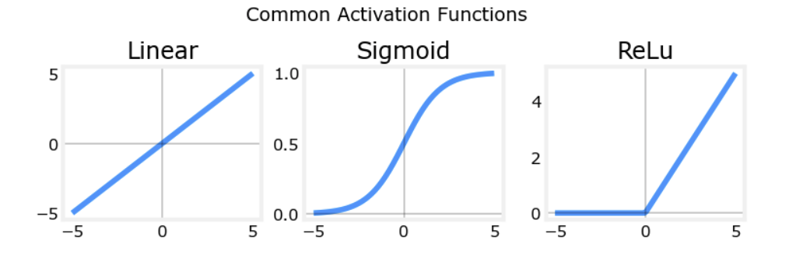
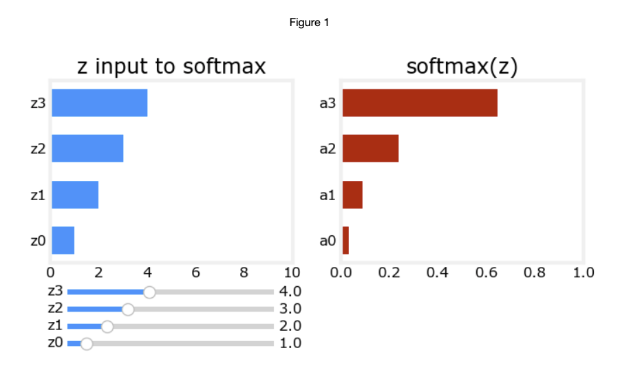
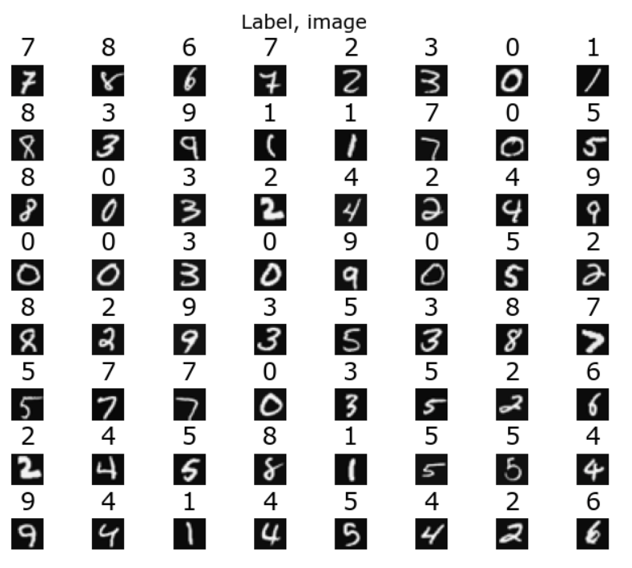
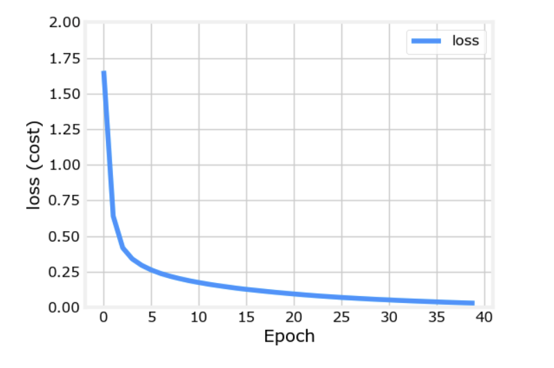
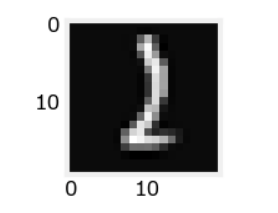
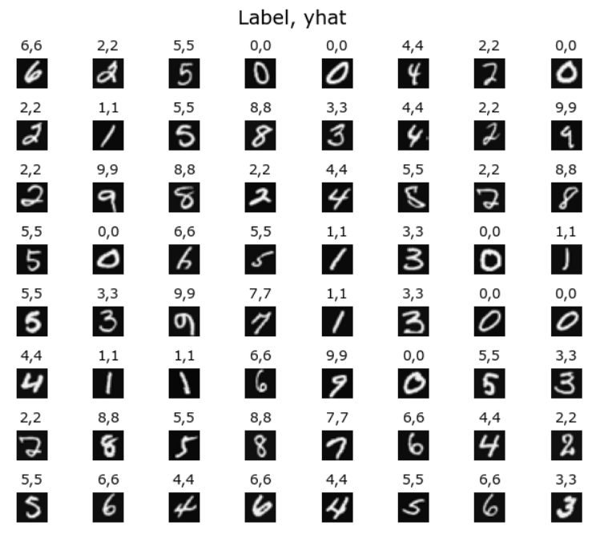
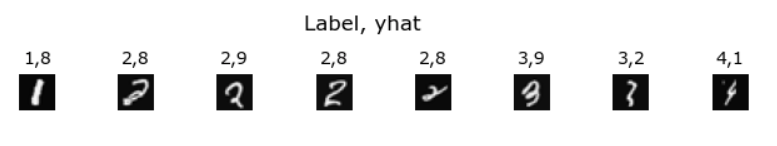

# Neural Networks for Handwritten Digit Recognition, Multiclass classification

Here, I built and utilized a neural network to do multiclass classification. The goal was to recognize the hand-written digits 0-9.

## Packages 

First I imported all the packages that I needed, including numpy (the fundamental package for scientific computing with Python), matplotlib (a popular library to plot graphs in Python), tensorflow (a popular platform for machine learning).

```python
import numpy as np
import tensorflow as tf
from tensorflow.keras.models import Sequential
from tensorflow.keras.layers import Dense
from tensorflow.keras.activations import linear, relu, sigmoid
%matplotlib widget
import matplotlib.pyplot as plt
plt.style.use('./deeplearning.mplstyle')

import logging
logging.getLogger("tensorflow").setLevel(logging.ERROR)
tf.autograph.set_verbosity(0)

from public_tests import * 

from autils import *
from lab_utils_softmax import plt_softmax
np.set_printoptions(precision=2)
```
## Rectified Linear Unit (ReLU) Activation
$$ a = max(0,z) \quad\quad\text {ReLU function} $$

  

The sigmoid is best for on/off or binary situations. The ReLU provides a continuous linear relationship. Additionally it has an 'off' range where the output is zero. The "off" feature makes the ReLU a Non-Linear activation, which enables multiple units to contribute to to the resulting function without interfering. 

## Softmax Function
A multiclass neural network generates N outputs. One output is selected as the predicted answer. In the output layer, a vector $\mathbf{z}$ is generated by a linear function which is fed into a softmax function. The softmax function converts $\mathbf{z}$  into a probability distribution as described below. After applying softmax, each output will be between 0 and 1 and the outputs will sum to 1. They can be interpreted as probabilities. The larger inputs to the softmax will correspond to larger output probabilities.

The softmax function can be written:
$$a_j = \frac{e^{z_j}}{ \sum_{k=0}^{N-1}{e^{z_k} }}$$

Where $z = \mathbf{w} \cdot \mathbf{x} + b$ and N is the number of feature/categories in the output layer.  

Here, I created a NumPy implementation of softmax function (One implementation uses for loop to first build the denominator and then a second loop to calculate each output), and performed unit testing, which was all passed:

```python
# UNQ_C1
# GRADED CELL: my_softmax

def my_softmax(z):  
    """ Softmax converts a vector of values to a probability distribution.
    Args:
      z (ndarray (N,))  : input data, N features
    Returns:
      a (ndarray (N,))  : softmax of z
    """    
    ### START CODE HERE ###
    
    N = len(z)
    a = np.zeros(N)                        # initialize a to zeros 
    ez_sum = 0                             # initialize sum to zero
    for k in range(N):                     # loop over number of outputs 
        ez_sum += np.exp(z[k])             # sum exp(z[k]) to build the shared denominator     
    for j in range(N):                     # loop over number of outputs again  
        a[j] = np.exp(z[j]) / ez_sum       # divide each the exp of each output by the denominator  
        
    ### END CODE HERE ### 
    return a
```
```python
z = np.array([1., 2., 3., 4.])
a = my_softmax(z)
atf = tf.nn.softmax(z)
print(f"my_softmax(z):         {a}")
print(f"tensorflow softmax(z): {atf}")

# BEGIN UNIT TEST  
test_my_softmax(my_softmax)
# END UNIT TEST  
```
    my_softmax(z):         [0.03 0.09 0.24 0.64]
    tensorflow softmax(z): [0.03 0.09 0.24 0.64]
    All tests passed.

Below, vary the values of the `z` inputs. Note in particular how the exponential in the numerator magnifies small differences in the values. Note as well that the output values sum to one.

```python
plt.close("all")
plt_softmax(my_softmax)
```
  

## Neural Networks

Here, I implemented a neural network to do multiclass classification, which utilized the softmax activation.

### Problem Statement

I used a neural network to recognize ten handwritten digits, 0-9. This is a multiclass classification task where one of n choices is selected. Automated handwritten digit recognition is widely used today - from recognizing zip codes (postal codes) on mail envelopes to recognizing amounts written on bank checks. 

### Dataset

I started by loading the dataset for this task. The `loadmat` function loads the data into variables `X` and `y`

- The data set contains 5000 training examples of handwritten digits.  
    - Each training example is a 20-pixel x 20-pixel grayscale image of the digit. 
        - Each pixel is represented by a floating-point number indicating the grayscale intensity at that location. 
        - The 20 by 20 grid of pixels is “unrolled” into a 400-dimensional vector. 
        - Each training examples becomes a single row in our data matrix `X`. 
        - This gives us a 5000 x 400 matrix `X` where every row is a training example of a handwritten digit image.      
- The second part of the training set is a 5000 x 1 dimensional vector `y` that contains labels for the training set
    - `y = 0` if the image is of the digit `0`, `y = 4` if the image is of the digit `4` and so on.

In order to get more familiar with dataset I printed out each variable and view what it contains. Then I Checked the dimensions of variable, I printed the shape of `X` and `y` and saw how many training examples I have in dataset. Here, the shape of X is: (5000, 400) and the shape of y is: (5000, 1).


#### Visualizing the Data

I begun by visualizing a subset of the training set. 

- In the cell below, the code randomly selects 64 rows from `X`, maps each row back to a 20 pixel by 20 pixel grayscale image and displays the images together. 
- The label for each image is displayed above the image 


```python
import warnings
warnings.simplefilter(action='ignore', category=FutureWarning)

m, n = X.shape

fig, axes = plt.subplots(8,8, figsize=(5,5))
fig.tight_layout(pad=0.13,rect=[0, 0.03, 1, 0.91]) #[left, bottom, right, top]

#fig.tight_layout(pad=0.5)
widgvis(fig)
for i,ax in enumerate(axes.flat):
    # Select random indices
    random_index = np.random.randint(m)
    
    # Select rows corresponding to the random indices and
    # reshape the image
    X_random_reshaped = X[random_index].reshape((20,20)).T
    
    # Display the image
    ax.imshow(X_random_reshaped, cmap='gray')
    
    # Display the label above the image
    ax.set_title(y[random_index,0])
    ax.set_axis_off()
    fig.suptitle("Label, image", fontsize=14)
```
  


### Model representation

The neural network I used 

- This has two dense layers with ReLU activations followed by an output layer with a linear activation. 
- Recall that inputs are pixel values of digit images.
- Since the images are of size $20\times20$, this gives us $400$ inputs  
- The parameters have dimensions that are sized for a neural network with $25$ units in layer 1, $15$ units in layer 2 and $10$ output units in layer 3, one for each digit.

    - Recall that the dimensions of these parameters is determined as follows:
        - If network has $s_{in}$ units in a layer and $s_{out}$ units in the next layer, then 
            - $W$ will be of dimension $s_{in} \times s_{out}$.
            - $b$ will be a vector with $s_{out}$ elements
    
    - Therefore, the shapes of `W`, and `b`,  are 
        - layer1: The shape of `W1` is (400, 25) and the shape of `b1` is (25,)
        - layer2: The shape of `W2` is (25, 15) and the shape of `b2` is: (15,)
        - layer3: The shape of `W3` is (15, 10) and the shape of `b3` is: (10,)

### Tensorflow Model Implementation

Tensorflow models are built layer by layer. A layer's input dimensions ($s_{in}$ above) are calculated for us. We specify a layer's *output dimensions* and this determines the next layer's input dimension. The input dimension of the first layer is derived from the size of the input data specified in the `model.fit` statement below. 

Below, I used Keras Sequential model and Dense Layer with a ReLU activation to construct the three layer network described above.

```python
# UNQ_C2
# GRADED CELL: Sequential model
tf.random.set_seed(1234) # for consistent results
model = Sequential(
    [               
        ### START CODE HERE ### 
        
        tf.keras.Input(shape = (400,)),
        Dense(25, activation = "relu", name = "L1"),
        Dense(15, activation = "relu", name = "L2"),
        Dense(10, activation = "linear", name = "L3")
        
        ### END CODE HERE ### 
    ], name = "my_model" 
)

```

```python
model.summary()
```
Here is my_model, and I performed unit tests, which was all passed.

```
Model: "my_model"
_________________________________________________________________
Layer (type)                 Output Shape              Param #   
=================================================================
L1 (Dense)                   (None, 25)                10025     
_________________________________________________________________
L2 (Dense)                   (None, 15)                390       
_________________________________________________________________
L3 (Dense)                   (None, 10)                160       
=================================================================
Total params: 10,575
Trainable params: 10,575
Non-trainable params: 0
_________________________________________________________________
```

```python
# BEGIN UNIT TEST     
test_model(model, 10, 400)
# END UNIT TEST    
All tests passed. 
```
    
The parameter counts shown in the summary correspond to the number of elements in the weight and bias arrays as shown below.
I further examined the weights to verify that tensorflow produced the same dimensions as I calculated above.

```python
[layer1, layer2, layer3] = model.layers
```
```python
#### Examine Weights shapes
W1,b1 = layer1.get_weights()
W2,b2 = layer2.get_weights()
W3,b3 = layer3.get_weights()
print(f"W1 shape = {W1.shape}, b1 shape = {b1.shape}")
print(f"W2 shape = {W2.shape}, b2 shape = {b2.shape}")
print(f"W3 shape = {W3.shape}, b3 shape = {b3.shape}")
```
Here is the reuslt,

    W1 shape = (400, 25), b1 shape = (25,)
    W2 shape = (25, 15), b2 shape = (15,)
    W3 shape = (15, 10), b3 shape = (10,)

The following code:
* defines a loss function, `SparseCategoricalCrossentropy` and indicates the softmax should be included with the  loss calculation by adding `from_logits=True`)
* defines an optimizer. A popular choice is Adaptive Moment (Adam).

```python
model.compile(
    loss=tf.keras.losses.SparseCategoricalCrossentropy(from_logits=True),
    optimizer=tf.keras.optimizers.Adam(learning_rate=0.001),
)

history = model.fit(
    X,y,
    epochs=40
)
```

#### Epochs and batches
In the `fit` statement above, the number of `epochs` was set to 40. This specifies that the entire data set should be applied during training 40 times.  During training, we saw output describing the progress of training that looks like this:
```
Epoch 1/40
157/157 [==============================] - 0s 1ms/step - loss: 2.2770
```
The first line, `Epoch 1/40`, describes which epoch the model is currently running. For efficiency, the training data set is broken into 'batches'. The default size of a batch in Tensorflow is 32. There are 5000 examples in our data set or roughly 157 batches. The notation on the 2nd line `157/157 [====` is describing which batch has been executed.

#### Loss  (cost)
Ideally, the cost will decrease as the number of iterations of the algorithm increases. Tensorflow refers to the cost as `loss`. Above, we saw the loss displayed each epoch as `model.fit` was executing. The `fit` method returns a variety of metrics including the loss. This is captured in the `history` variable above. This can be used to examine the loss in a plot as shown below.

```python
plot_loss_tf(history)
```
  

#### Prediction 
To make a prediction, I used Keras `predict`. Below, X[1015] contains an image of a two.

```python
image_of_two = X[1015]
display_digit(image_of_two)

prediction = model.predict(image_of_two.reshape(1,400))  # prediction

print(f" predicting a Two: \n{prediction}")
print(f" Largest Prediction index: {np.argmax(prediction)}")
```

  

     predicting a Two: 
    [[-12.42  -0.98   3.17  -0.22 -15.43  -9.4   -6.18  -3.17  -6.    -4.62]]
     Largest Prediction index: 2


The largest output is prediction[2], indicating the predicted digit is a '2'. 

Then I compared the predictions vs the labels for a random sample of 64 digits.

```python
import warnings
warnings.simplefilter(action='ignore', category=FutureWarning)

m, n = X.shape

fig, axes = plt.subplots(8,8, figsize=(5,5))
fig.tight_layout(pad=0.13,rect=[0, 0.03, 1, 0.91]) #[left, bottom, right, top]
widgvis(fig)
for i,ax in enumerate(axes.flat):
    # Select random indices
    random_index = np.random.randint(m)
    
    # Select rows corresponding to the random indices and
    # reshape the image
    X_random_reshaped = X[random_index].reshape((20,20)).T
    
    # Display the image
    ax.imshow(X_random_reshaped, cmap='gray')
    
    # Predict using the Neural Network
    prediction = model.predict(X[random_index].reshape(1,400))
    prediction_p = tf.nn.softmax(prediction)
    yhat = np.argmax(prediction_p)
    
    # Display the label above the image
    ax.set_title(f"{y[random_index,0]},{yhat}",fontsize=10)
    ax.set_axis_off()
fig.suptitle("Label, yhat", fontsize=14)
plt.show()
```
  


Certianly, there were some errors, increasing the number of training epochs could eliminate the errors on this data set.

  


